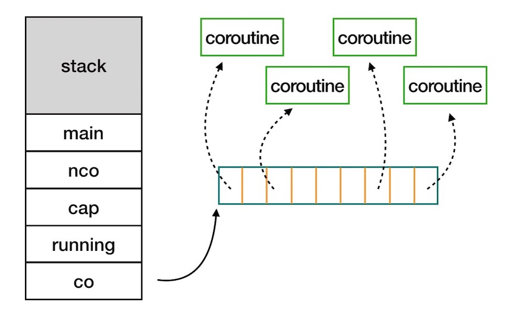
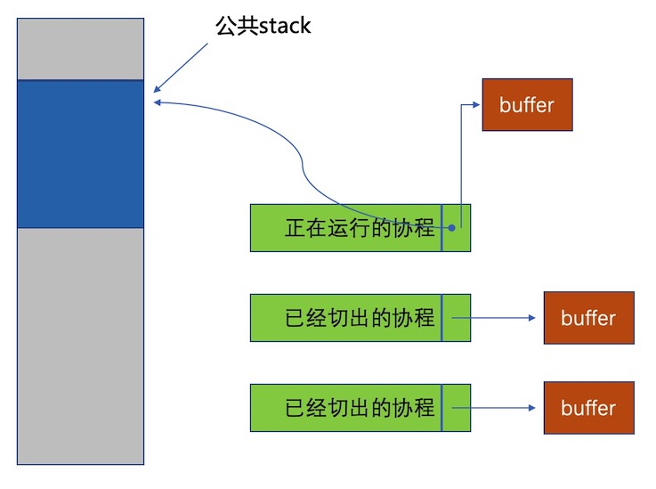
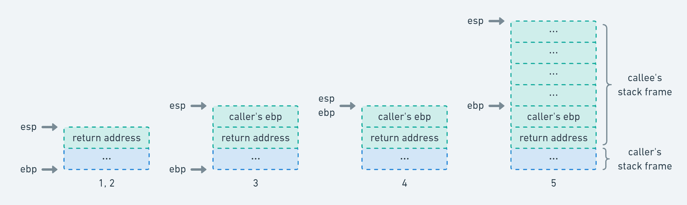
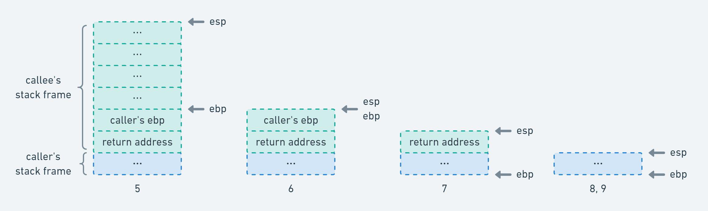

## 概念

### 定义

> Coroutines are computer program components that generalize subroutines for non-preemptive multitasking, by allowing execution to be suspended and resumed. 

> 译：协程是计算机程序组件，通过允许挂起和恢复执行来概括非抢先式多任务处理的子例程。

参考：
> https://en.wikipedia.org/wiki/Coroutine

- 协程的本地数据在后续调用中始终保持
- 协程在控制离开时暂停执行，当控制再次进入时只能从离开的位置继续执行

### 分类

#### 对称协程与非对称协程

- 对称协程 Symmetric Coroutine：任何一个协程都是相互独立且平等的，调度权可以在任意协程之间转移。
- 非对称协程 Asymmetric Coroutine：协程出让调度权的目标只能是它的调用者，即协程之间存在调用和被调用关系。

- 对称协程实际上已经非常接近线程的样子了，例如 Go 语言中的 go routine 可以通过读写不同的 channel 来实现控制权的自由转移。而非对称协程的调用关系实际上也更符合我们的思维方式，常见的语言对协程的实现大多是非对称实现，例如 Lua 的协程中当前协程调用 yield 总是会将调度权转移给 resume 它的协程；还有就是我们在前面提到的 async/await，await 时将调度权转移到异步调用中，异步调用返回结果或抛出异常时总是将调度权转移回 await 的位置。

- 从实现的角度来讲，非对称协程的实现更自然，也相对容易；不过，我们只要对非对称协程稍作修改，即可实现对称协程的能力。在非对称协程的基础上，我们只需要添加一个中立的第三方作为协程调度权的分发中心，所有的协程在挂起时都将控制权转移给分发中心，分发中心根据参数来决定将调度权转移给哪个协程，例如 Lua 的第三方库 coro，以及 Kotlin 协程框架中基于 Channel 的通信等。

#### 有栈协程与无栈协程

- 有栈协程 Stackful Coroutine：每一个协程都会有自己的调用栈，有点儿类似于线程的调用栈，这种情况下的协程实现其实很大程度上接近线程，主要不同体现在调度上。
- 无栈协程 Stackless Coroutine：协程没有自己的调用栈，挂起点的状态通过状态机或者闭包等语法来实现。

### 对比

协程 vs 函数
- 传统的程序都是依赖多个子程序（函数）的层次调用来完成的，如A调用B、B调用C，C执行完毕返回，B执行完毕返回，最后是A执行完毕返回；这些函数都是通过栈实现的，函数调用总是一个入口，一个栈空间，一次返回，调用顺序是明确的。
- 协程的调用与函数不同，协程看上去也是函数，但是在执行过程中，可以显式中断，转而去执行其他函数，在适当的时候再返回来执行；这有点像操作系统的线程，执行过程中可能被挂起，让位于别的线程执行，稍后又从挂起的地方恢复执行。
- 这个过程中，协程与协程之间实际上不是普通“调用者与被调者”的关系，他们之间的关系是对称的。

协程 vs 生成器
- 生成器（Generator）也是函数的一种泛化，但是比协程有局限性。
- 具体的说，两者都可以调用(yield)多次，暂停执行并回到入口初执行。但是他们在控制执行后的处理是不同的，生成器只能将控- 制权交还给调用生成器的地方，也就是说，生成器主要用于简化迭代器的编写，因此其中的yield不能跳转到特定的函数，只能将值传回到调用者函数中。

协程 vs 递归
- 使用协程有点像使用递归，数据控制都切换到了不同的函数中。
- 协程会更灵活高效，因为协程是yield而不是return，是resume执行而不是从头开始，因此更容易保存状态。
- 递归函数则需要使用共享变量或传输状态参数。此外，递归调用需要新的堆栈而协程则可以复用现有的上下文。

协程 vs 回调
- 都实现异步通信，但是协程代码可读性、可维护性更好。

## 例子

### demo

```lua
function foo(n)
    local i = 0
    while i < 5 do
        local id, status = coroutine.running()
        print(id, n + i)
        coroutine.yield()
        i = i + 1
    end
end

function test()
    local co1 = coroutine.create(foo)
    local co2 = coroutine.create(foo)
    print("main start")
    coroutine.resume(co1, 0)
    coroutine.resume(co2, 100)
    while coroutine.status(co1) ~= "dead" and coroutine.status(co2) ~= "dead" do
        coroutine.resume(co1)
        coroutine.resume(co2)
    end
    print("main end")
end

test()
```

结果
```
main start
thread: 0x7fffc100baf8  0
thread: 0x7fffc100be68  100
thread: 0x7fffc100baf8  1
thread: 0x7fffc100be68  101
thread: 0x7fffc100baf8  2
thread: 0x7fffc100be68  102
thread: 0x7fffc100baf8  3
thread: 0x7fffc100be68  103
thread: 0x7fffc100baf8  4
thread: 0x7fffc100be68  104
main end
```

### 生产者消费者

```lua
local newProducer

function producer()
     local i = 0
     while true do
          if i >= 5 then
               break
          end
          i = i + 1
          print(string.format("produce:%d", i))
          send(i)
     end
end

function consumer()
     while true do
          local i = receive()
          print(string.format("consume:%d", i))
          if i >= 5 then
               break
          end
     end
end

function receive()
     local status, value = coroutine.resume(newProducer)
     return value
end

function send(x)
     coroutine.yield(x)
end

newProducer = coroutine.create(producer)
consumer()
```

执行结果
```
produce:1
consume:1
produce:2
consume:2
produce:3
consume:3
produce:4
consume:4
produce:5
consume:5
```

## 实现

### 无栈协程

```c++
#define BEGIN_CORO void operator()() { switch(next_line) { case 0:
#define YIELD next_line=__LINE__; break; case __LINE__:
#define END_CORO }} int next_line=0
```

```c++
#include <iostream>
#include "super_super_super_super_lightweight_stackless_coroutine_framework.h"

struct SomeCoroutine {
	int n_; // Add whatever you want
	SomeCoroutine(int n) : n_(n) {}
	
	BEGIN_CORO;
	std::cout << "coroutine" << n_ << " hello 1" << std::endl;
	YIELD;
	std::cout << "coroutine" << n_ << " hello 2" << std::endl;
	YIELD;
	std::cout << "coroutine" << n_ << " hello 3" << std::endl;
	END_CORO;
};

int main() {
	SomeCoroutine co1(1);
	SomeCoroutine co2(2);
	co1();
	co2();
	co1();
	co2();
	co1();
	co2();
}
```
打印

```
coroutine1 hello 1
coroutine2 hello 1
coroutine1 hello 2
coroutine2 hello 2
coroutine1 hello 3
coroutine2 hello 3
```

参考：
> https://zhuanlan.zhihu.com/p/32312942

Duff's device：
> https://www.chiark.greenend.org.uk/~sgtatham/coroutines.html

### 有栈协程

一个基于共享栈的非对称协程实践
> https://github.com/peigongdh/coroutinedh

关键代码

```c
struct schedule {
    char stack[STACK_SIZE];    // 运行时栈，此栈即是共享栈

    ucontext_t main; // 主协程的上下文，当创建的协程调用coroutine_yield切出控制权，实际上会切到主协程运行
    int nco;        // 当前存活的协程个数
    int cap;        // 协程管理器的当前最大容量
    int running;    // 正在运行的协程 ID
    struct coroutine **co; // 一个一维数组，用于存放所有协程。其长度等于 cap
};
```



```c
struct coroutine {
    coroutine_func func; // 协程所用的函数
    void *ud;  // 协程参数
    ctx_context_t ctx; // 协程上下文
    struct schedule *sch; // 该协程所属的调度器
    ptrdiff_t cap;     // 已经分配的内存大小
    ptrdiff_t size; // 当前协程运行时栈，保存起来后的大小
    int status;    // 协程当前的状态
    char *stack; // 当前协程的保存起来的运行时栈
};
```



```c
void
coroutine_resume(struct schedule *S, int id) {
    // ...
    case COROUTINE_READY:
        // 初始化ucontext_t结构体,将当前的上下文放到C->ctx里面
        ctx_getcontext(&C->ctx);
        // 将当前协程的运行时栈的栈顶设置为S->stack
        // 每个协程都这么设置，这就是所谓的共享栈。（注意，这里是栈顶）
        C->ctx.stack = S->stack;
        C->ctx.stack_size = STACK_SIZE;
        // 如果协程执行完，将切换到主协程中执行
        C->ctx.link = &S->main;
        S->running = id;
        C->status = COROUTINE_RUNNING;

        // 设置执行C->ctx函数, 并将S作为参数传进去
        ctx_makecontext(&C->ctx, (int (*)(void *)) mainfunc, (void *) S);

        // 将当前的上下文放入S->main中，并将C->ctx的上下文替换到当前上下文
        ctx_swapcontext(&S->main, &C->ctx);
        break;
    case COROUTINE_SUSPEND:
        // 将协程所保存的栈的内容，拷贝到当前运行时栈中
        // 其中C->size在yield时有保存
        memcpy(S->stack + STACK_SIZE - C->size, C->stack, C->size);
        S->running = id;
        C->status = COROUTINE_RUNNING;
        ctx_swapcontext(&S->main, &C->ctx);
        break;
    // ...
}
```

```c
void
coroutine_yield(struct schedule *S) {
    // ...
    // 将当前运行的协程的栈内容保存起来
    _save_stack(C, S->stack + STACK_SIZE);

    // 将当前栈的状态改为 挂起
    C->status = COROUTINE_SUSPEND;
    S->running = -1;

    // 所以这里可以看到，只能从协程切换到主协程中
    ctx_swapcontext(&C->ctx, &S->main);
    // ...
```


参考：
> https://github.com/cloudwu/coroutine/

源码分析参考：
> https://www.cyhone.com/articles/analysis-of-cloudwu-coroutine/

> http://www.xiaocc.xyz/2018-12-14/%E5%8D%8F%E7%A8%8B%E5%8E%9F%E7%90%86%E8%A7%A3%E6%9E%903/

### ucontext库

```c
ucontext_t *uc_link     pointer to the context that will be resumed
                        when this context returns
sigset_t    uc_sigmask  the set of signals that are blocked when this
                        context is active
stack_t     uc_stack    the stack used by this context
mcontext_t  uc_mcontext a machine-specific representation of the saved
                        context
```

- 当当前上下文(如使用 makecontext 创建的上下文）运行终止时系统会恢复uc_link指向的上下文；
- uc_sigmask为该上下文中的阻塞信号集合；
- uc_stack为该上下文中使用的栈；
- uc_mcontext保存的上下文的特定机器表示，包括调用线程的特定寄存器等。

```c
int  getcontext(ucontext_t *);
int  setcontext(const ucontext_t *);
void makecontext(ucontext_t *, (void *)(), int, ...);
int  swapcontext(ucontext_t *, const ucontext_t *);
```

### 函数调用栈

```c
int callee() { // callee:
               //   pushl %ebp
               //   movl  %esp, %ebp
               //   subl  $16, %esp
    int x = 0; //   movl  $0, -4(%ebp)
    return x;  //   movl -4(%ebp), %eax
               //   leave
               //   ret
}

int caller() { // caller:
               //   pushl %ebp
               //   movl  %esp, %ebp
    callee();  //   call  callee
    return 0;  //   movl  $0, %eax
               //   popl  %ebp
               //   ret
}
```

当 caller 调用 callee 时，执行了以下步骤（注意注释中的执行顺序）：



```c
callee:
    // 3. 将 caller 的栈帧底部地址入栈保存
    pushl %ebp
    // 4. 将此时的调用栈顶部地址作为 callee 的栈帧底部地址
    movl  %esp, %ebp
    // 5. 将调用栈顶部扩展 16 bytes 作为 callee 的栈帧空间；
    //    在 x86 平台中，调用栈的地址增长方向是从高位向低位增长的，
    //    所以这里用的是 subl 指令而不是 addl 指令
    subl  $16, %esp
    ...
caller:
    ...
    // "call callee" 等价于如下两条指令：
    // 1. 将 eip 存储的指令地址入栈保存；
    //    此时的指令地址即为 caller 的 return address，
    //    即 caller 的 "movl $0, %eax" 这条指令所在的地址
    // 2. 然后跳转到 callee
    pushl %eip
    jmp callee
    ...
```

当 callee 返回 caller 时，则执行了以下步骤（注意注释中的执行顺序）：



```c
callee:
    ...
    // "leave" 等价于如下两条指令：
    // 6. 将调用栈顶部与 callee 栈帧底部对齐，释放 callee 栈帧空间
    // 7. 将之前保存的 caller 的栈帧底部地址出栈并赋值给 ebp
    movl %ebp, %esp
    popl %ebp
    // "ret" 等价如下指令：
    // 8. 将之前保存的 caller 的 return address 出栈并赋值给 eip，
    //    即 caller 的 "movl $0, %eax" 这条指令所在的地址
    popl eip
caller:
    ...
    // 9. 从 callee 返回了，继续执行后续指令
    movl $0, %eax
    ...
```

### 自己实现ucontext

```c
// 保存当前上下文到oucp结构体中，然后激活upc上下文。
int swapcontext(ucontext_t *oucp, ucontext_t *ucp);
```

```c
asm("\
.globl _ctx_swapcontext \n\
.globl ctx_swapcontext \n\
_ctx_swapcontext: \n\
ctx_swapcontext: \n"
#if CTX_OS_WINDOWS || __CYGWIN__
    "movq %rcx, %rax; \n"
#else
    "movq %rdi, %rax; \n"
#endif
    "\n\
    movq %rdx, 24(%rax); \n\
    movq %rax, 0(%rax); \n\
    movq %rbx, 8(%rax); \n\
    movq %rcx, 16(%rax); \n\
    movq %rsi, 32(%rax); \n\
    movq %rdi, 40(%rax); \n\
    leaq 8(%rsp), %rdx; \n\
    movq %rdx, 48(%rax); \n\
    movq %rbp, 56(%rax); \n\
    movq 0(%rsp), %rdx; \n\
    movq %rdx, 64(%rax); \n\
    pushfq; \n\
    popq %rdx;  \n\
    movq %rdx, 72(%rax); \n\
    movq %r8, 80(%rax); \n\
    movq %r9, 88(%rax); \n\
    movq %r10, 96(%rax); \n\
    movq %r11, 104(%rax); \n\
    movq %r12, 112(%rax); \n\
    movq %r13, 120(%rax); \n\
    movq %r14, 128(%rax); \n\
    movq %r15, 136(%rax); \n\
    movq 24(%rax), %rdx; \n\
    stmxcsr 144(%rax); \n\
    fnstenv 152(%rax); \n\
    fldenv 152(%rax); \n"
#if CTX_OS_WINDOWS || __CYGWIN__
    "movq %rdx, %rax\n"
#else
    "movq %rsi, %rax\n"
#endif
    "\n\
    movq 8(%rax), %rbx; \n\
    movq 16(%rax), %rcx; \n\
    movq 24(%rax), %rdx; \n\
    movq 32(%rax), %rsi; \n\
    movq 40(%rax), %rdi; \n\
    movq 48(%rax), %rsp; \n\
    movq 56(%rax), %rbp; \n\
    movq 64(%rax), %rdx; \n\
    pushq %rdx; \n\
    movq 72(%rax), %rdx; \n\
    pushq %rdx; \n\
    popfq; \n\
    movq 80(%rax), %r8; \n\
    movq 88(%rax), %r9; \n\
    movq 96(%rax), %r10; \n\
    movq 104(%rax), %r11; \n\
    movq 112(%rax), %r12; \n\
    movq 120(%rax), %r13; \n\
    movq 128(%rax), %r14; \n\
    movq 136(%rax), %r15; \n\
    movq 24(%rax), %rdx; \n\
    ldmxcsr 144(%rax); \n\
    fldenv 152(%rax); \n\
    movq 0(%rax), %rax; \n\
    ret; \n\
");
```

参考：
> https://github.com/skywind3000/collection/tree/master/vintage/context

> https://zhuanlan.zhihu.com/p/32431200

## 应用场景

- 游戏场景切换
> https://gameinstitute.qq.com/community/detail/107515

- libco是微信后台大规模使用的c/c++协程库，2013年至今稳定运行在微信后台的数万台机器上。
- libco通过仅有的几个函数接口 co_create/co_resume/co_yield 再配合 co_poll，可以支持同步或者异步的写法，如线程库一样轻松。同时库里面提供了socket族函数的hook，使得后台逻辑服务几乎不用修改逻辑代码就可以完成异步化改造。
> https://github.com/Tencent/libco

## 参考文档

- 协程的几类常见的实现
> https://www.bennyhuo.com/2019/12/01/coroutine-implementations/

- 协程-什么是协程
> http://blackfox1983.github.io/posts/2018/05/06/intro-of-coroutine-1/

- ucontext-人人都可以实现的简单协程库
> https://blog.csdn.net/qq910894904/article/details/41911175

- 有栈协程与无栈协程
> https://mthli.xyz/stackful-stackless/

- 寄存器保存
> https://en.wikipedia.org/wiki/X86_calling_conventions#Caller-saved_(volatile)_registers

- ucontext manual
> https://pubs.opengroup.org/onlinepubs/7908799/xsh/ucontext.h.html